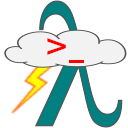
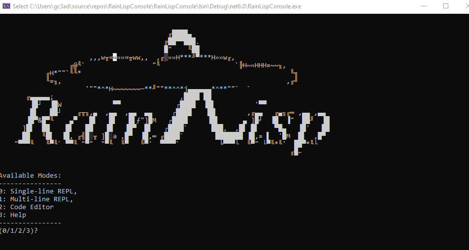

# RainLisp Console

[](https://www.nuget.org/packages/RainLispConsole/)
[](LICENSE.txt)





RainLisp Console allows you to run the programs you write in [RainLisp](https://github.com/chr1st0scli/RainLisp).

It can be used in three ways:

- In REPL mode (Read-Evaluate-Print Loop) that allows you to evaluate code incrementally.
- As a code editor with syntax highlighting, basic code completion, source code file management and code evaluation.
- As a tool with command line arguments that allows the interpreter to be used with other editors or tools.

## Installation
You need to have .NET 6 or later installed.

In order to download RainLispConsole from NuGet and install it as a global tool, run the following command in a command line shell.
```
dotnet tool install -g RainLispConsole --version "*-alpha*"
```

If you already have it installed and you want to update it, run the following command.
```
dotnet tool update -g RainLispConsole --version "*-alpha*"
```

## Usage
Run the following command.
```
RainLispConsole
```
If needed, you can then choose the *Help* mode to see more information.

In order to get started with RainLisp, you can visit its [repository](https://github.com/chr1st0scli/RainLisp) where you can find a tutorial and other material.
